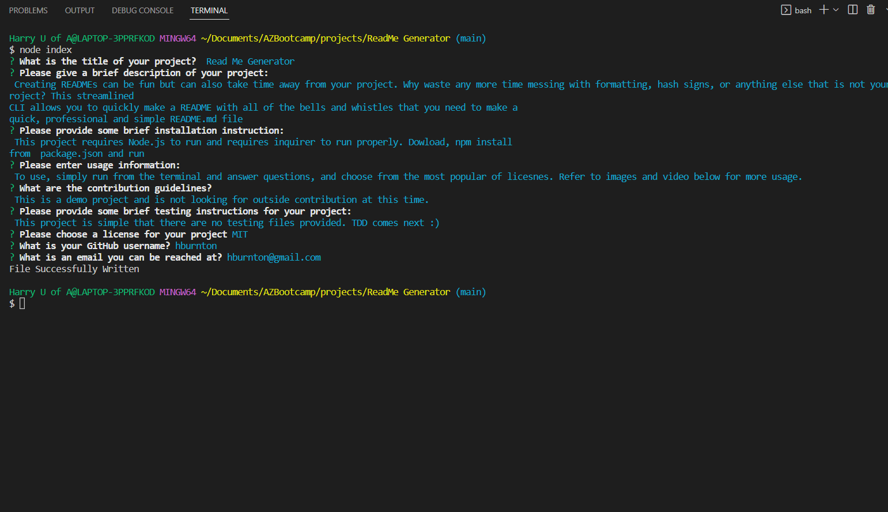

# Read Me Generator

## Description
Creating READMEs can be fun but can also take time away from your project. Why waste any more time messing with formatting, hash signs, or anything else that is not your project? This streamlined CLI allows you to quickly make a README with all of the bells and whistles that you need to make a quick, professional and simple README.md file. In fact, this file was made using this app!

### Table of contents
- [Description](#description)
- [Installation Instructions](#installation-instructions)
- [Usage Guidelines](#usage-guidelines)
- [Contribution Guidelines](#contribution-guidelines)
- [Testing Information](#testing-information)
- [Contact](#contact)

## Installation Instructions
This project requires Node.js to run and requires inquirer to run properly. Download, npm install from  package.json and run

## Usage Guidelines
To use, simply run from the terminal and answer questions, and choose from the most popular of licenses. Refer to images and video below for more usage.

### Video
Click Below to see a video of the application in action

[Video Link](https://youtu.be/kiUzZARYJRc)

### Image
Check out the image below to see the skelton of this readme being built in the application

## Contribution Guidelines
This is a demo project and is not looking for outside contribution at this time.

## Testing Information
This project is simple that there are no testing files provided. TDD comes next :)

## Questions? Contact me
[Find me on GitHub](https://github.com/hburnton)

[Send me an email](mailto:hburnton@gmail.com)

## License
This project licensed under the MIT license.
[Details on the MIT license](https://choosealicense.com/licenses/mit/)
